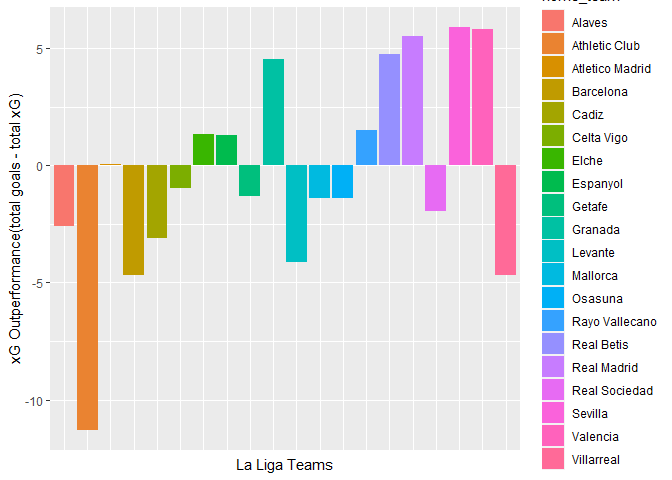
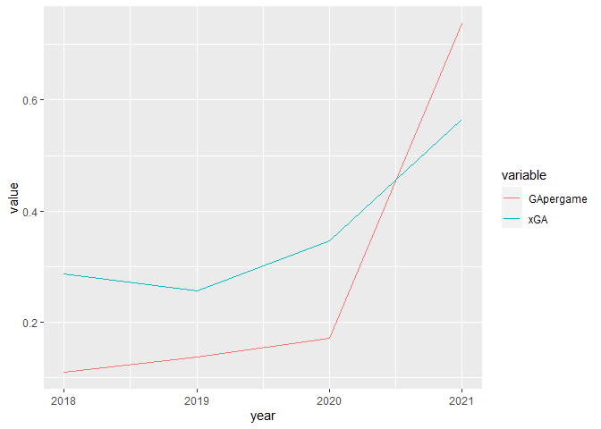

23/12 by Smitesh Patil


------------------------------------------------------------------------

Real Madrid are enjoying their season in the Spanish league. The current
table toppers are on a 10 game winning streak as midseason draws near,
title rivals Barcelona and Atletico underperforming make them massive
favorites among the bookies for this season’s championship. However,
there are concerns that their current form is not sustainable as they
are massively outperforming their expected goals. And there are various
reasons for that.

------------------------------------------------------------------------

``` r
out %>%
  ggplot(aes(x = home_team, y = tot_goals - tot_xG, fill = home_team)) +
  geom_bar(stat = "identity") +
  labs(x = "La Liga Teams", y = "xG Outperformance(total goals - total xG)") +
  theme(axis.text.x = element_blank(),
        axis.ticks.x = element_blank())
```

## 

# 1. The way opposition playes vs Real

Real Madrid’s squad is arguably the best in the whole league, because of
this opposition tends to sit deep in their half as a result the chances
they create have a relatively less xG. Expected goals or xG is a metric
used in football to analyze the quality of chances and chances of
scoring or conceding goals based on the position of shots, player
positioning, and other measures As oppositions defend in huge numbers in
their box this creates a low xG value for most of the goals which skew
the data. Furthermore, Karim Benzema as a striker tends to drop between
the lines for facilitating build-up play which consequently leads to a
lower xG as the striker of the team is far away from typical
goal-scoring positions.

# 2. Rise of Vinicius Jr


Vinicius Junior has been one of the breakout stars this La Liga season.
The Brazilian has scored so far 10 goals and assisted 4 in his current
La Liga campaign his highest tally so far. This season his goals/assists
per 90 minutes have surpassed expected numbers a testament to the work
he’s put in to improve his finishing as he showed in his recent
match-winning goal versus Sevilla FC.

``` r
years <- list('2018', '2019', '2020', '2021')

vini_stats <- function(x){
  year <- understat_team_players_stats(paste("https://understat.com/team/Real_Madrid/", x, sep = "")) %>%
    select(player_name, games, goals, assists, xG, xA) %>%
    filter(player_name == "Vinícius Júnior") %>%
    mutate(year = x)
  
  return(year) 
}

vini_stats <-lapply(years, vini_stats)
vini_stats <- do.call(rbind, vini_stats)

vini_stats$year <- as.numeric(as.character(vini_stats$year))

vini_stats %>%
  mutate(GApergame = (goals + assists)/ games, xGA = (xG + xA)/ games) %>%
  select(GApergame, xGA, year) %>%
  melt(id = 'year') %>%
  ggplot(aes(x= year, y= value, color = variable)) + geom_line()
```



# 3. Can this momentum be sustained ?

In previous 20/21 La liga season, Atletico Madrid had a similar start to
their campaign thanks to players like Luis Suarez and Marcos Llorente
outperforming their xG which made them title favorites in first half of
the season. Whether Real can sustain this results is to be seen in
future.
